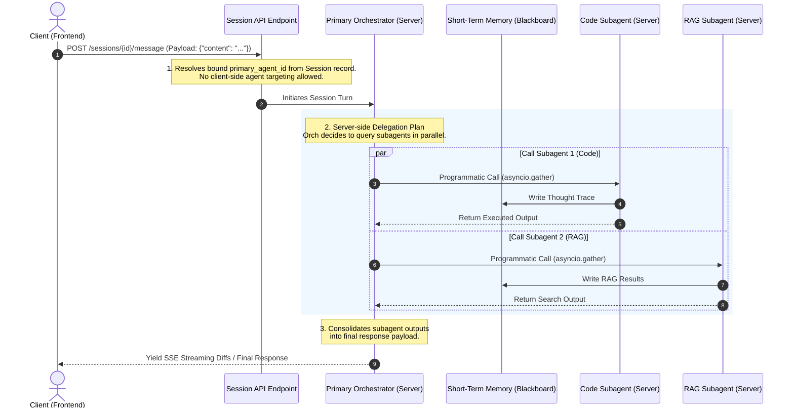

# Design Analysis: Server-Side Multi-Agent Delegation & Session Architecture

## 1. Context & Motivation

In the initial Personal Local Agent Manager (PLAM) iteration, sending a message to a session required passing the target `agent_id` inside the message payload (`POST /sessions/{session_id}/message`). 

While this design allowed the client (frontend) to easily target different agents using a shared blackboard database model, it introduces several critical production concerns:

1. **Security Vulnerability (Client-Side Logic Selection)**: By allowing the client to determine which agent processes a message, a malicious or compromised client could directly target highly privileged subagents (such as the `CodeExecutorAgent`) and execute arbitrary system operations, completely bypassing the guardrails and prompt filters enforced by the primary `OrchestratorAgent`.
2. **Logic Leakage & High Coupling**: The frontend is forced to maintain agent mappings and coordinate delegation topology, exposing deep backend microservices and orchestration mechanics.
3. **Parallel Concurrency Complications**: Tying execution triggers directly to client REST requests makes running parallel subagents (e.g. running research, database querying, and code execution concurrently in parallel) extremely difficult to synchronize, schedule, and aggregate.

To eliminate these concerns, this document outlines the migration to a **Server-Side Multi-Agent Delegation** system where chat sessions are bound strictly to a primary orchestrator agent, and all delegation happens securely and concurrently behind the scenes on the server.

---

## 2. Redesigned System Flow

Under this model, the client only communicates with the single entry point. The primary agent makes the active decision to spawn, delegate to, and aggregate subagent outputs.



---

## 3. Key Benefits

### A. Strict Server-Side Security
* **Privileged Code Protection**: Subagents (such as code-execution sandboxes or MCP tool handlers) are **hidden** from the public REST API surface. They can only be triggered by internal python code-paths under the explicit permission and monitoring of the primary Orchestrator.
* **Filter Integrity**: Input filters, user authorization checks, and system prompts are executed first by the Orchestrator before any delegation, preventing prompt injection attacks from reaching core subagents.

### B. High-Performance Concurrency (Parallel Execution)
* **Programmatic Parallelism**: Because delegation runs purely in Python on the server, the Orchestrator can leverage standard concurrent libraries (`asyncio.gather` or `anyio` task groups) to run multiple subagents in parallel.
* **Real-time Consensus**: The Orchestrator can wait for all parallel subagents to complete, consolidate their blackboard updates, evaluate conflict resolutions, and synthesize a single, perfect output for the client.

### C. Clean & Decoupled Frontend
* **Stateless Client Requests**: The client payload is reduced to a simple structure: `{"content": "..."}`. The client does not need to know which models or agents are actively processing the turn, making the client lightweight and decoupled.

---

## 4. Implementation Steps

### 1. Database Schema Migration
- Modify the `sessions` table to add a `primary_agent_id` column:
  ```python
  primary_agent_id = Column(UUID(as_uuid=True), ForeignKey("agents.id"), nullable=False)
  ```
- Keep `ShortTermMemory.agent_id` message-level stamps as-is so that the blackboard correctly retains which subagent generated each intermediate memory or execution trace.

### 2. API Endpoint Refactoring (`chat.py`)
- Remove the `agent_id` field from the client's `MessageRequest` payload.
- Update `POST /sessions/{session_id}/message` to:
  1. Retrieve the `Session` from the database.
  2. Read `session.primary_agent_id`.
  3. Query `orchestrator_service.run_chat_stream` using the retrieved `primary_agent_id`.

### 3. Server-Side Execution & Subagent Invocation
- Update `OrchestratorService` to support programmatic subagent execution:
  ```python
  async def run_subagent_turn(self, subagent_id: UUID, session_id: UUID, instruction: str, db: Session) -> str:
      # Invoke subagent synchronously or asynchronously internally, writing to the ShortTermMemory blackboard
      ...
  ```
