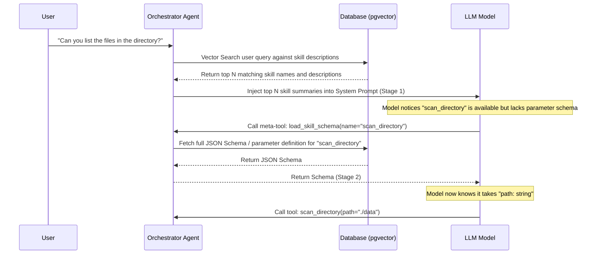

# Tools & Security Design Document (Phase 4)

This document outlines the technical design, data models, APIs, and security architectures for Phase 4 of PLAM (Tools & Security). It details RAG-driven dynamic skill loading, Model Context Protocol (MCP) cache synchronization, authentication workflows, and Docker sandboxing constraints.

---

## 1. Skill RAG & Dynamic Loading Architecture

To prevent system prompt bloat and context window saturation, PLAM employs a **2-Stage RAG-Filtered, LLM-Driven Dynamic Loading** architecture for skills.

### Data Models & Indexing
- **Database Schema**: The existing `skills` table will map to packages.
- **pgvector Vector Database**: We use PostgreSQL's `pgvector` extension. A new table `skill_embeddings` is introduced to map skill descriptions to their high-dimensional vector representations.
- **Embedding Generation**: A local sentence-transformers model (e.g., `all-MiniLM-L6-v2`) runs within the Python backend, computing embeddings during skill import/sync.

### Skill Ingestion & Import Pathways
PLAM supports the following primary ingestion routes to install, register, and manage skills:
1. **Archive Upload (`.zip` / `.skills`)**: 
   - **`.skills` files**: PLAM supports `.skills` files, which are standard zip or gzip-compressed tar archives containing one or more skills.
   - **Ingestion flow**: The user uploads a `.zip` or `.skills` archive. The backend extracts it into the dedicated local skills directory, verifies the presence of the required `SKILL.md` file in each extracted skill subfolder, parses their frontmatter metadata to cache it in the database, and generates description embeddings for RAG indexing.
2. **Remote Repository Fetch (Git / `npx skills` style)**:
   - **Repository Fetching**: Users can specify a Git repository URL (e.g., a shared public/private GitHub repository of skills) or trigger a sync command referencing a registry.
   - **Ingestion flow**: The backend clones the repository (or fetches a tarball of the main branch), scans the repository recursively for folders containing a `SKILL.md` file, validates their configuration schemas, extracts assets/scripts, and saves them to the local skills folder.
3. **Standalone Script Upload (Generic Skills)**:
   - **Ingestion flow**: Users can upload a single script file (e.g., `.py`, `.sh`, `.js`). Since it lacks the required structured metadata, the **Skill Inferrer Agent** is dynamically invoked. It analyzes the script's source code and any inline comments, auto-generates a corresponding `SKILL.md` file containing the inferred parameter schemas and sandboxing permissions, and organizes it into a standard skill folder structure.


### Execution Sequence



1. **Stage 1 (Pre-Query RAG)**: On receiving a user message, the Orchestrator runs a pgvector query against the `skills` description index. It injects a minimal markdown bulleted list of the top $N$ matching skills (names and descriptions only) into the system prompt.
2. **Stage 2 (LLM-Driven Schema Loading)**: If the LLM determines a skill is needed, it calls a built-in meta-tool `load_skill_schema(name: str)`. The Orchestrator resolves the schema (parameters, manual, and usage instructions) from the database and returns it. The LLM can then construct the precise tool call in the subsequent generation turn.

---

## 2. MCP Integration & Cache Synchronization

External MCP servers (which can expose dozens of tools) follow the same 2-stage loading strategy. To avoid network overhead on every message, tool schemas are cached locally and synced.

### Data Synchronization & Hashing
- **Caching**: The local database `mcp_tools` table stores cached tool definitions, schemas, and endpoint mappings.
- **Connection Startup Hashing**: On subprocess or SSE connection initialization:
  1. The client requests the complete tools list from the server via `tools/list`.
  2. The client calculates a SHA-256 hash of the list and compares it with the hash stored in the DB.
  3. If they differ, the client updates the `mcp_tools` cache and re-indexes tool descriptions in the vector DB.
- **Real-Time Notifications**: The client listens for the MCP standard JSON-RPC notification `notifications/tools/list-changed`. Upon receiving it, the client triggers an asynchronous sync routine to refresh the cache.
- **Periodic Connection Refresh**: A background task executes every 2 hours to refresh active MCP connections, verify server health, renew expiring OAuth tokens, and sync schemas if tool lists have drifted.

### Dynamic Loading
- When RAG identifies relevant MCP tools, the names and descriptions are added to the prompt.
- The LLM calls the meta-tool `load_mcp_tool_schema(name: str)` to fetch the JSON schema for arguments.

---

## 3. MCP Authentication Flow

PLAM supports both local and remote MCP integrations, accommodating varying authentication schemes securely.

```
+-------------------------------------------------------------------------+
|                              MCP Servers                                |
+------------------------------------+------------------------------------+
|               stdio                |                SSE                 |
|            (Subprocess)            |              (Remote)              |
+------------------------------------+------------------------------------+
|  - API keys / Tokens injected      |  - Static Headers (Authorization)  |
|    into subprocess Environment.    |  - OAuth2 Browser Flow (Access &   |
|                                    |    Refresh Tokens in DB)           |
+------------------------------------+------------------------------------+
```

### Stdio Subprocess Authentication
- Authentication tokens or API keys are stored encrypted in the database.
- When spawning the local MCP server subprocess via Docker or the host daemon, these credentials are decrypted and injected directly as environment variables.

### SSE (Server-Sent Events) Authentication
- **Static Authentication**: Supports static headers (e.g. `Authorization: Bearer <token>`, `X-API-Key`) entered in settings.
- **OAuth2 Flow**: For remote MCP platforms:
  1. User clicks "Authorize MCP Server" in Settings.
  2. PLAM initiates an OAuth2 Authorization Code flow, redirecting the user to the MCP server's login portal.
  3. The redirect URI endpoint on the PLAM backend receives the code, exchanges it for access and refresh tokens, and saves them (encrypted) in the database.
  4. SSE connection headers are dynamically generated using active access tokens, using refresh tokens when renewals are required.

---

## 4. Docker Sandboxing Security Model

To protect the host system from arbitrary execution during skill scripting, all skill runs are sandboxed in isolated Docker containers.

### Dual-Category Skill Model
Skills processed by PLAM fall into two categories depending on their source and structured metadata:
- **PLAM-Native Skills**: Packaged specifically for PLAM. They contain a frontmatter declaration (YAML or JSON) defining parameter schemas, manuals, and explicit sandboxing permissions.
- **Generic Skills**: User-loaded scripts or command descriptions lacking structured metadata. For these, the **Skill Inferrer Agent** is invoked in the background. It analyzes the raw script and descriptions to dynamically infer the parameter schemas, usage manuals, and minimal required permissions (e.g. file mounts, network) before registering them.

### Sandboxed Container Execution Environment
Skills run inside isolated Docker containers using a secure base image containing pre-installed runtimes and dependencies:
- **Pre-installed Runtimes**: The sandbox container comes with **Python** and **Node.js** preinstalled.
- **Default Libraries**:
  - *Python*: Standard data/scraping helper packages like `requests`, `urllib3`, `numpy`, `pandas`, `beautifulsoup4`.
  - *Node.js*: Common utility packages like `axios` and `lodash`.
- **Dynamic Python Library Installation**: If a skill requests additional Python packages (declared in the skill's frontmatter or dynamically inferred by the Inferrer Agent), the container launcher triggers an isolated installation step (`pip install --no-cache-dir`) within the container's ephemeral filesystem layer prior to executing the skill script.

### Declared Package Permissions
Each Package declares a set of capabilities that its associated skills may request. The Orchestrator spawns containers with matching flags:

| Permission | Default | Implementation Constraint |
| :--- | :--- | :--- |
| `network` | `false` | If `false`, container spawns with `--network none`. |
| `read_host_dir` | `none` | Path restricted. Spawns as read-only mount: `-v path:target:ro`. |
| `write_host_dir` | `none` | Path restricted. Spawns as read-write mount: `-v path:target:rw`. |
| `max_memory` | `512m` | Rigid limit passed as `--memory=512m`. |
| `max_cpu` | `1.0` | Rigid CPU share limit passed as `--cpus=1`. |

### Security Review Agent & Approval Workflow
Every script execution goes through a static/dynamic check before spawning:

```
[Tool Call Issued]
       |
       v
[Security Review Agent]
       |
       +---> [Passes Declared Permissions Check?]
                   |
                   +---> No  ---> [Pause Execution & Prompt User Approval]
                   |
                   +---> Yes ---> [Detects Suspicious Calls? (e.g. system files, rm)]
                                        |
                                        +---> Yes ---> [Pause Execution & Prompt User Approval]
                                        +---> No  ---> [Run Sandboxed Container]
```

1. **Permission Check**: The Security Review Agent evaluates the code/commands against the declared Package Permissions. Any attempt to modify unapproved system files or connect to blacklisted ports triggers an immediate pause.
2. **Suspicious Code Classification**: A specialized local LLM parses the script for shell injection patterns, command chaining, or resource exhaustion loops (e.g. fork bombs).
3. **Human-in-the-Loop Approval API**: If flagged, the endpoint returns a `403 Request Approval` status. The frontend intercepts this and displays a modal inside the Chat window, showing the proposed script and asking for user permission to run it (`Approve` / `Deny`).
